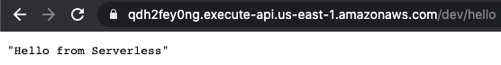
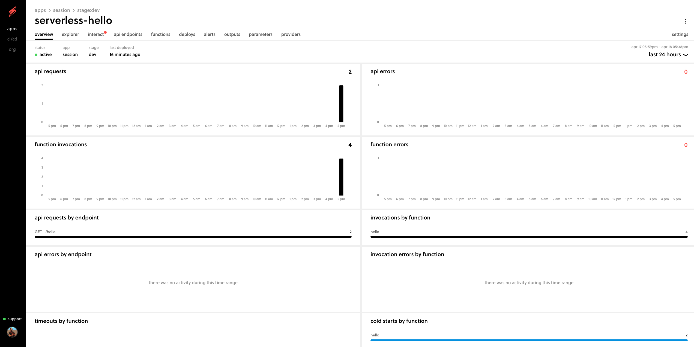

# Serverless Demo


## Login
```sh
serverless login
```

## Create Struct
```sh
serverless create --template aws-nodejs
```

## Deploy
```sh
serverless deploy
```

## Remove
```sh
serverless remove
```

### Hello Endpoint



### Amazing Serverless Dashboard 😊



